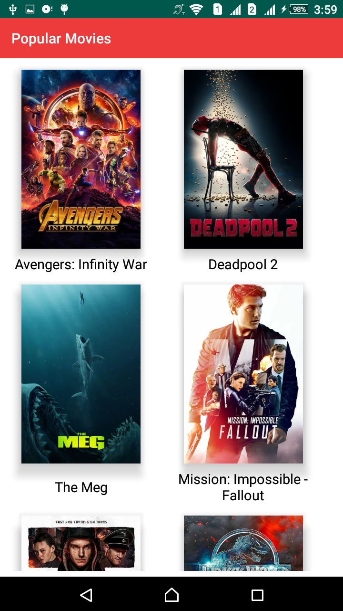
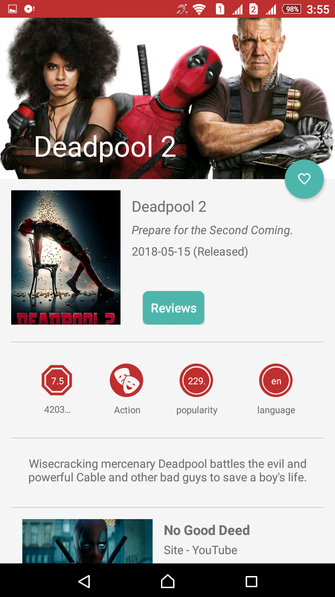
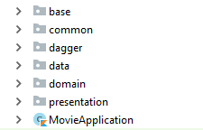
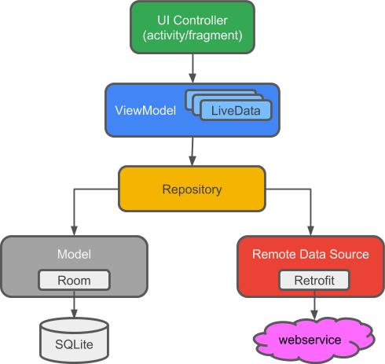

## MovieApp

## Project Overview

This project aims to demonstrate the usage of Android Architecture Components and how this components can be used in an application with a MVVM architecture in Kotlin 

## Project Description

First of all, I would like to show how I made the packages structure of the project For achieving The separation of concerns 

- ## Presentation layer 
    The Activities, Fragments and ViewModels.

- ## Domain layer 
    With the Use Cases that  will include all business logic and interact between Data and Presentation layer by means of interface and     interactors. The objective is to make the domain layer independent of anything, so the business logic can be tested without 
    any dependency to external components.

- ##  Data layer 
    With the Repositories.

## Let's explore Architecture Components  
According to [Android Documentation](https://developer.android.com/topic/libraries/architecture), Architecture Components are a set of Android libraries for structuring your app in a way that is robust, testable, and maintainable

## UI Controllers  
are activities or fragments. The only job of UI controllers is to know how to display data and pass on UI events, such as the user pressing a button. UI Controllers neither contain the UI data, nor directly manipulate data.

## ViewModels and LiveData 

These classes represent all of the data needed for the UI to display. You'll learn exactly how these two classes function together in this Project.

## Repository 

This class is the single source of truth for all of our app's data and acts as a clean API for the UI to communicate with. ViewModels simply request data from the repository. They do not need to worry about whether the repository should load from the database or network, or how or when to persist the data. The repository manages all of this. As part of this responsibility, the repository is a mediator between the different data sources.

## Remote Network Data Source 

Manages data from a remote data source, such as the internet.

Model - Manages local data stored in the database.

### Used libraries: ###
- [RxJava2](https://github.com/ReactiveX/RxJava)
- [RxAndroid](https://github.com/ReactiveX/RxAndroid)
- [Retrofit2](https://github.com/square/retrofit)
- [Android architecture components](https://developer.android.com/topic/libraries/architecture/index.html)
- [Room Persistence Library](https://developer.android.com/topic/libraries/architecture/room.html)
- [Picasso](https://github.com/square/picasso)

### Refrences: ###
- [ِAndroid Documentation](https://developer.android.com/topic/libraries/architecture)
- [source code for the official Google I/O 2018 for Android app](https://android-developers.googleblog.com/2018/08/google-releases-source-for-google-io.html)
- [Architecture Components Code Lab](https://codelabs.developers.google.com/codelabs/build-app-with-arch-components/index.html?index=..%2F..%2Findex#0)

### License: ###
~~~~
Copyright 2018 Mohammed Mahmoud 

Licensed under the Apache License, Version 2.0 (the "License");
you may not use this file except in compliance with the License.
You may obtain a copy of the License at

   http://www.apache.org/licenses/LICENSE-2.0

Unless required by applicable law or agreed to in writing, software
distributed under the License is distributed on an "AS IS" BASIS,
WITHOUT WARRANTIES OR CONDITIONS OF ANY KIND, either express or implied.
See the License for the specific language governing permissions and
limitations under the License.
~~~~
